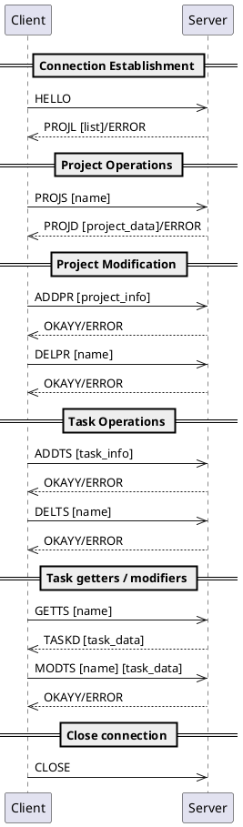

# Task Management Protocol Documentation

## Overview

The Task Management Protocol (TMP) is a task management protocol that allows managing tasks between a client and a server. 

## Transport protocol

The TMP protocol is a text message protocol. It must use TCP (Transmission Control Protocol) to ensure reliable communication. It must also use port 6433. 

Every message must be encoded in UTF-8 and delimited by a newline character (\n). The messages are treated as text messages.

The initial connection must be established by the client.

A lot of the data passed as payloads are formatted in `json`. 

When errors occur, the client should negate (in any way possible) the action that returned an error. 

The server only answers the clients messages. There is no message from the server to the client if the client didn't do a request first. 

Once a client has disconnected, the server must close the connection and remove the client from the list of connected clients.

    
## Messages
### HELLO
- Purpose: Establish connection with server
- Request: `HELLO`
- Response: 
  - Success: `PROJL [json_project_list]` - Returns list of all projects
  ```
  {
    "projectNames": [
      "Project1",
      "Project2",
      "Project3"
    ]
  }
  ```
  - Failure: `ERROR [error_message]`


## Project Operations
### PROJS (Project Select)
- Purpose: Select/request a specific project
- Request: `PROJS [project_name]`
- Parameters:
  - project_name: String identifier of the project
- Response:
  - Success: `PROJD [project_data]`
  - Failure: `ERROR [error_message]`
### PROJD (Project Data)
- Purpose: Server response containing project details
  - Response: 
  - Success: `PROJD [project_data]`
    ```
    {
      "name": "Project1",
      "tasks": [
        {
          "name": "task1",
          "metadata": {
            "priority": "high",
            "due": "2024-12-01"
          }
        },
        {
          "name": "task2",
          "metadata": null
        },
        {
          "name": "task3",
          "metadata": null
        }
      ]
    }
    ```
      - Failure: `ERROR [error_message]`


## Project Modifications
### ADDPR (Add Project)
- Purpose: Create a new project
- Request: `ADDPR [project_info]`
- Parameters:
  ```
  {
    "name": "ProjectX"
  }
  ```
- Response:
    - Success: `OKAYY`
    - Failure: `ERROR [error_message]`


### DELPR (Delete Project)
- Purpose: Remove an existing project
- Request: `DELPR [project_name]`
- Parameters:
    - project_name: String identifier of project to delete
- Response:
    - Success: `OKAYY`
    - Failure: `ERROR [error_message]`

## Task Operations
### ADDTS (Add Task)
- Purpose: Create a new task in current project
- Request: `ADDTS [task_info]`
- Parameters:
    ```
    {
      "tasks": {
        "name": "task1",
        "metadata": {
          "priority": "high",
          "due": "2024-12-01"
        }
      }
    }
    ```
- Response:
    - Success: `OKAYY`
    - Failure: `ERROR [error_message]`

### DELTS (Delete Task)
- Purpose: Remove an existing task
- Request: `DELTS [task_name]`
- Parameters:
  - task_name: String identifier of task to delete
- Response:
  - Success: `OKAYY`
  - Failure: `ERROR [error_message]`

### GETTS (Get Task)
- Purpose: Request details of a specific task
- Request: `GETTS [task_name]`
- Parameters:
  - task_name: String identifier of task
- Response:
  - Success: `TASKD [task_data]`
  
  _eg1_
   ```
    {
      "tasks": {
        "name": "task1",
        "metadata": {
          "priority": "high",
          "due": null
        }
      }
    }
    ```
  _eg2_
  ```
    {
      "tasks": {
        "name": "task1",
        "metadata": null
      }
    }
    ```
  - Failure: `ERROR [error_message]`

### MODTS (Modify Task)
- Purpose: Update an existing task
- Request: `MODTS [task_name] [task_data]`
- Parameters:
  - task_name: String identifier of task
  - task_data: Updated task information
  
  _general modification_
  ```
    {
      "tasks": {
        "name": "task1",
        "metadata": {
          "priority": "high",
          "due": "2024-12-01"
        }
      }
    }
    ```

  _eg: to change only the due date_
  ```
    {
      "tasks": {
        "metadata": {
           "due": "2024-12-01"
        }
      }
    }
   ```
  _eg: to change the name_
  ```
    {
      "tasks": {
        "name": "task1",
      }
    }
    ```
  _eg:to remove the priority_
  ```
    {
      "tasks": {
        "metadata": {
          "priority": null,
        }
      }
    }
    ```
- Response:
  - Success: `OKAYY`
  - Failure: `ERROR [error_message]`

## Response Codes
### OKAYY
- Indicates successful completion of requested operation
### ERROR
- Indicates operation failure

## Database format (.json)
    {
      "projects": [
        {
          "name": "Project1",
          "tasks": [
            {
              "name": "task1",
              "metadata": {
                "priority": "high",
                "due": "2024-12-01"
              }
            },
            {
              "name": "task2",
              "metadata": null
            },
            {
              "name": "task3",
              "metadata": null
            }
          ] 
        },
        {
          "name": "Project2",
          "tasks": [
            {
              "name": "task1",
              "metadata": null
            },
            {
              "name": "task2",
              "metadata": {
                "priority": "low",
                "due": "2024-11-30"
              }
            }
          ]
        }
      ]
    }

  ### General instruction about the database format
  - The name of project and task must never be null !
  - Metadata, priority or due could be null.
  - If priority and due are null, then metadata become null.
  - A project could be void (having zero task).
  - Every name must be different.

## Diagram


